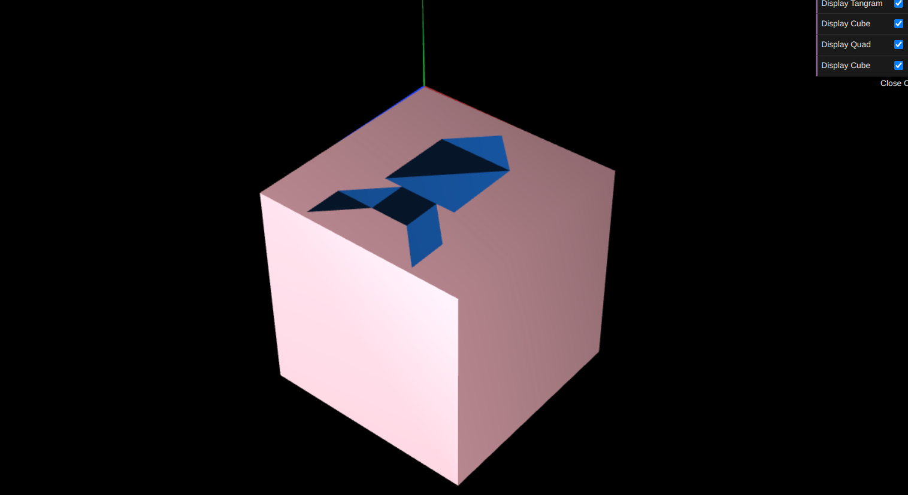

# CG 2022/2023

## Group T08G08

## TP 2 Notes

We accomplished all tasks. In exercise 1 we didn't have any difficulties.

In exercise 2, we had some difficulties understanding what was the base and what size it was supposed to be. We believe we did it as it was supposed to.

Exercise 3 was completed without difficulties. We used colors to make it easier to visualize
all objects.

